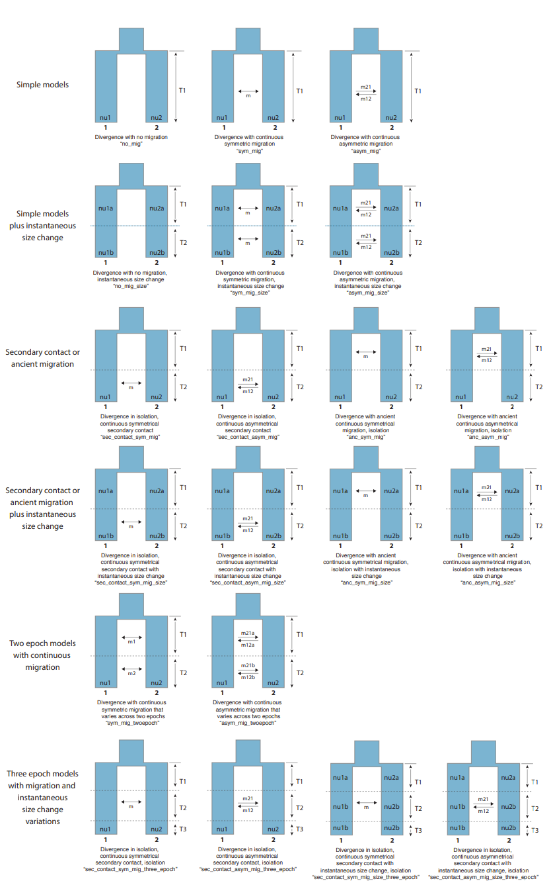

# moments_pipeline_parallel
dportik's 2D moments script modified to accept a SFS as input and for parallelization in linux

---

## USAGE: Find most likely model of demographic history

The strategy is to run all of the models and identify which one has the most support

0. Clone this repo to your local computer
	```
	git clone https://github.com/cbirdlab/moments_pipeline_parallel.git
	```
	
2. Make sfs with [easySFS](https://github.com/isaacovercast/easySFS)
	* get vcf and popmap
	* convert popmap to the format required by easySFS (swap the columns)
	* run the preview
	* select the number of individuals
	* make the sfs
	```
	easySFS.py -i file.vcf -p example_files/pops.txt --preview -a
	easySFS.py -i file.vcf -p example_files/pops.txt -o outputdirname -a --proj=10,10
	```
	
2. Make sure all dependencies are installed
    * [moments](https://bitbucket.org/simongravel/moments/src/master/)
    * [dportik moments_pipeline dependencies](https://github.com/dportik/moments_pipeline)
    * gnu parallel

3. Make sure the proper anaconda environment is activated and you are in the correct directory in the repo
	```bash
	# deactivate unwanted environments
	# conda activate InsertNameOfEnvironmentHereIfNecessary
	cd moments_pipeline_parallel/2D_ml-search
	```

4. Run the following lines of code (modify variables as necessary)
	```bash
	screen -S moments2D
	#deactivate any undesired python envs
	THREADS=4 
	sfsPATH=../../easySFS/output_28_80/dadi/pop1-pop2.sfs
	POP1ID="pop1"
	POP2ID="pop2"
	ls moments_Run_2D_??_*py | parallel --no-notice -j $THREADS "python {} $sfsPATH $POP1ID $POP2ID"
	```
 _The `screen` command is optional.  Duckduckgo it.  To detach from the screen, `ctrl+a`  then `d` _

5. When complete, run `Summarize_Outputs.py` 
	```bash
	python Summarize_Outputs.py .
	```
  The `.` indicates the output is in the present directory
  
6. You can interface with all raw model output files directly using `summarize_outputs.R` in R Studio


---

## USER DEFINED VARIABLES
### THREADS

set this to the number of cpu cores available / 8

### sfsPATH

path to the site freq spectrum file

### POP1ID

The name of population sample 1 used in the sfs

### POP2ID

The name of the population sample 2 used in the sfs

---

## DEMOGRAPHIC MODELS

The models implemented are those from [Leache et al 2019](https://onlinelibrary.wiley.com/doi/10.1111/jbi.13716).  They can be visualized in Figure S1 [here](jbi13716-sup-0001-supinfo.pdf)



--- 

## OTHER USEFUL CITATIONS

https://github.com/kfarleigh/Moments & https://onlinelibrary.wiley.com/doi/full/10.1111/mec.16070

https://github.com/z0on/AFS-analysis-with-moments


